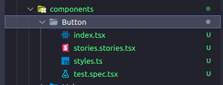

# NextJS Boilerplate 📄
This is a boilerplate for next applications based on the boilerplate made in the [React Avancado Course](https://reactavancado.com.br/).

# Tools ⚙️
What is inside?
- [NextJS](https://nextjs.org/);
- [React](https://pt-br.reactjs.org/);
- [Styled Components](https://styled-components.com/);
- [Framer Motion](https://www.framer.com/motion/);
- [Jest](https://jestjs.io/);
- [Testing Library](https://testing-library.com/);
- [Storybook](https://storybook.js.org/);
- [Eslint](https://eslint.org/);
- [TypeScript](https://www.typescriptlang.org/);
- [Husky](https://typicode.github.io/husky/#/);
- [Lint Staged](https://github.com/okonet/lint-staged);
- [Plop](https://plopjs.com/);


Everything is already configured, you just need to code! 🚀

# Tips 🧠

### Generating an automatic folder structure
Run in your terminal:
```yarn generate <ComponentName>```

A folder component with the following structure will be generated and automatically configured!



You just need to implement your stuff! :)

### Creating a next app with this template
Clone this repository in your project and change the github origin\
```git clone git@github.com:giovanedann/next-boilerplate.git```

Or start a next project with this template directly from the command line\
```npx create-next-app -e https://github.com/giovanedann/next-boilerplate```\
```yarn create-next-app -e https://github.com/giovanedann/next-boilerplate```

### Running your stories
To run your stories, type this in your terminal\
```yarn storybook```\
```npm run storybook```

Then wait, and access http://localhost:6006 to see your stories!
